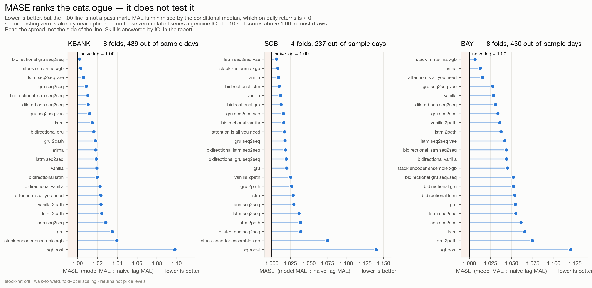
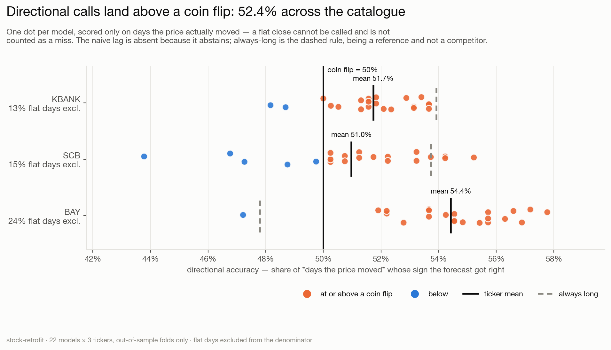
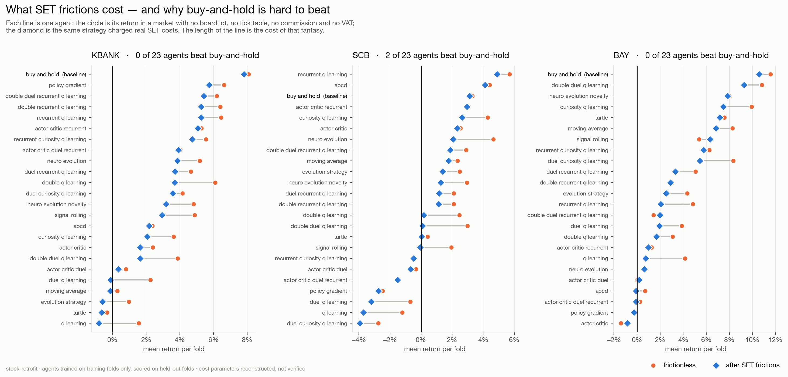
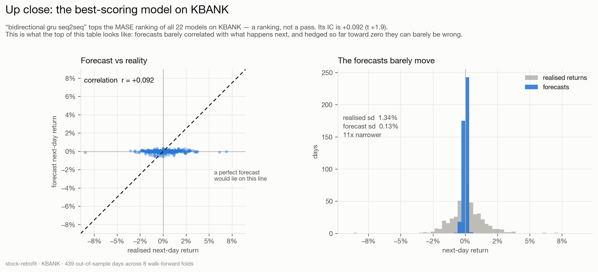

# stock-retrofit — results

Generated 2026-08-14 09:03 UTC · git `94c83f63b35ac57337dc240f298bc14fb16d7e84-dirty` · seed 42

Walk-forward evaluation of the [huseinzol05/Stock-Prediction-Models](https://github.com/huseinzol05/Stock-Prediction-Models) catalogue on Thai SET bank shares, on a harness that does not leak and a backtest that charges SET trading costs.

## How to read this

- **IC** is the out-of-sample correlation between a model's forecast and the return that actually happened. **This is the skill column.** A daily equity IC of 0.02-0.05 is a real signal and 0.10 is excellent; 0.00 is knowing nothing. `t` is its t-statistic — but read it against the count of models tested, because one or two in twenty clear |t| > 1.96 by chance and models sharing a feature set are not independent draws.
- **MASE** is MAE(model) / MAE(naive lag) on next-day returns, and is a **ranking, not a test**. There is deliberately no 'beats naive' column: MAE is minimised by the conditional median, which on daily returns is ≈ 0, so a forecast of zero is already near-optimal and anything that moves off it pays — and on a series where 13-24% of days close unchanged, a flat day adds nothing to the denominator and pure error to the numerator. A simulated forecaster with a genuine IC of 0.10 crosses MASE 1.00 in 27% of draws on KBANK, 34% on SCB and 0% on BAY, so a table of MASE ≥ 1.00 says more about the metric than about the catalogue.
- **dir_acc** counts calls made on days the price **actually moved**. Flat closes are excluded from the denominator: `sign(0)` matches no forecast, so a day that did not move is a guaranteed miss for every model, and on these tickers 13-24% of sessions close unchanged on the SET tick grid. `flat_share` in the CSV reports how many were set aside. The naive lag abstains everywhere, so its accuracy is undefined rather than zero.
- **Two reference rows are pinned to the top of every table.** `naive_lag` is the reference for the forecast as a number; `always_long` is the reference for it as a position — its Sharpe is what holding the share paid over the same blocks.
- Vendor-padded non-sessions are excluded. yfinance fills SET holidays with a zero-volume, zero-range bar repeating the previous close; the 'return' on one is zero by construction. Those rows are dropped from the labels and orders are refused on those bars.
- **sharpe_net** is annualised, after a round-trip cost of 0.336%. **sharpe_gross** charges nothing.
- Splits: 750 training bars, 60-bar test blocks, step 60, up to 8 of the most recent folds — a truncated history yields fewer, and the per-ticker `folds` column says how many actually ran. Every scaler is fit inside its own fold.

> **Cost figures are reconstructed, not verified** against SET's rulebook or a broker schedule (spec R13). Treat them as order-of-magnitude.

## Figures

Rendered by `notebooks/07_figures.ipynb` — one figure per cell.

## Universe

**KBANK** — Kasikornbank PCL
  - liquidity: Large cap, liquid, no known discontinuity. The clean case.
  - 6594 bars 2000-01-04 → 2026-08-13, source `yfinance`, hash `65593b0d9856`, 0 repaired field(s)

**SCB** — SCB X PCL (formerly The Siam Commercial Bank PCL)
  - liquidity: Large cap, liquid. Series carries an issuer substitution at 2022-04-22.
  - break 2022-04-22 [issuer_substitution]: SCB delisted and SCB X PCL listed 1:1 in its place, retaining the SCB ticker. A change of issuer (bank -> holding company), not merely of name. Pre-2022-04-22 'SCB' bars belong to a different legal entity.
  - source: SCB/SCBX first-party announcements, March-April 2022
  - 1047 bars 2022-04-20 → 2026-08-13, source `yfinance`, hash `80cd33cbe28b`, 0 repaired field(s)

**BAY** — Bank of Ayudhya PCL (Krungsri)
  - liquidity: Thin float: ~72-76% held by MUFG since the 2013 acquisition. Daily turnover is small relative to SCB/KBANK. Treat as the liquidity stress case and cap participation in any backtest.
  - default participation cap: 5.0% of volume
  - 6594 bars 2000-01-04 → 2026-08-13, source `yfinance`, hash `f40091c34855`, 0 repaired field(s)

## KBANK

### Forecasting models

| model | IC | t | MASE | dir acc | RMSE(ret) | Sharpe net | Sharpe gross |
|---|---|---|---|---|---|---|---|
| 00_naive_lag | — | — | 1.0000 | — | 0.01347 | +0.00 | +0.00 |
| 00_always_long | +0.047 | +1.0 | 1.0010 | 53.9% | 0.01344 | +1.69 | +1.70 |
| 14_bidirectional_gru_seq2seq | +0.092 | +1.9 | 1.0017 | 53.7% | 0.01343 | +0.95 | +1.72 |
| 19_stack_rnn_arima_xgb | -0.021 | -0.4 | 1.0031 | 53.4% | 0.01344 | +1.33 | +1.34 |
| 12_lstm_seq2seq_vae | +0.036 | +0.7 | 1.0059 | 50.5% | 0.01348 | +0.66 | +0.92 |
| 13_gru_seq2seq | +0.131 | +2.8 | 1.0088 | 51.6% | 0.01339 | +0.83 | +1.66 |
| 11_bidirectional_lstm_seq2seq | +0.033 | +0.7 | 1.0101 | 52.1% | 0.01353 | +0.86 | +1.16 |
| 18_dilated_cnn_seq2seq | +0.103 | +2.2 | 1.0106 | 52.9% | 0.01344 | -0.05 | +1.88 |
| 15_gru_seq2seq_vae | +0.040 | +0.8 | 1.0120 | 51.6% | 0.01353 | +1.52 | +1.93 |
| 01_lstm | +0.078 | +1.6 | 1.0148 | 53.1% | 0.01352 | +1.32 | +1.93 |
| 05_bidirectional_gru | +0.055 | +1.2 | 1.0163 | 51.8% | 0.01353 | +0.33 | +1.51 |
| 06_gru_2path | +0.072 | +1.5 | 1.0178 | 51.3% | 0.01354 | +0.85 | +1.82 |
| 21_arima | -0.051 | -1.1 | 1.0183 | 48.2% | 0.01359 | -2.02 | +1.18 |
| 10_lstm_seq2seq | +0.048 | +1.0 | 1.0187 | 53.1% | 0.01358 | +1.13 | +1.59 |
| 07_vanilla | +0.014 | +0.3 | 1.0194 | 51.8% | 0.01367 | -0.67 | +1.26 |
| 02_bidirectional_lstm | +0.065 | +1.4 | 1.0197 | 50.0% | 0.01355 | +0.70 | +1.29 |
| 08_bidirectional_vanilla | +0.002 | +0.0 | 1.0225 | 51.6% | 0.01363 | +0.14 | +1.76 |
| 16_attention_is_all_you_need | +0.025 | +0.5 | 1.0233 | 52.4% | 0.01370 | +0.86 | +1.24 |
| 09_vanilla_2path | -0.009 | -0.2 | 1.0234 | 53.7% | 0.01370 | +0.03 | +1.72 |
| 03_lstm_2path | +0.070 | +1.5 | 1.0242 | 48.7% | 0.01362 | +0.74 | +1.59 |
| 17_cnn_seq2seq | +0.074 | +1.5 | 1.0283 | 53.7% | 0.01361 | +0.56 | +2.23 |
| 04_gru | +0.063 | +1.3 | 1.0350 | 51.6% | 0.01368 | +0.80 | +1.84 |
| 20_stack_encoder_ensemble_xgb | -0.004 | -0.1 | 1.0395 | 50.3% | 0.01389 | -1.19 | +0.95 |
| 22_xgboost | -0.012 | -0.2 | 1.0982 | 51.3% | 0.01453 | -0.84 | +1.43 |

**Mean IC +0.041 over 22 models on KBANK; 17 of 22 positive.** 2 clear |t| > 1.96, against 1 expected by chance: 13_gru_seq2seq, 18_dilated_cnn_seq2seq.

Holding KBANK scored a net Sharpe of **+1.69** over the same blocks. **0 of 22 models beat it.**

### Agents — frictionless vs. SET frictions

| agent | return (free) | return (frictions) | cost of frictions | Sharpe net | trades | max DD |
|---|---|---|---|---|---|---|
| 00_buy_and_hold | +8.09% | +7.82% | +0.27% | +1.41 | 8 | -11.33% |
| 04_policy_gradient | +6.63% | +5.75% | +0.88% | +1.40 | 37 | -16.42% |
| 13_double_duel_recurrent_q_learning | +6.19% | +5.42% | +0.77% | +1.51 | 34 | -4.97% |
| 09_double_recurrent_q_learning | +6.39% | +5.27% | +1.13% | +1.58 | 49 | -7.00% |
| 08_recurrent_q_learning | +6.45% | +5.26% | +1.18% | +1.58 | 52 | -5.81% |
| 16_actor_critic_recurrent | +5.29% | +5.07% | +0.21% | +1.52 | 10 | -5.06% |
| 19_recurrent_curiosity_q_learning | +5.55% | +4.74% | +0.81% | +1.31 | 34 | -6.07% |
| 17_actor_critic_duel_recurrent | +4.03% | +3.91% | +0.12% | +1.10 | 4 | -10.78% |
| 21_neuro_evolution | +5.18% | +3.85% | +1.33% | +1.04 | 53 | -12.26% |
| 12_duel_recurrent_q_learning | +4.65% | +3.71% | +0.94% | +0.96 | 40 | -11.20% |
| 07_double_q_learning | +6.10% | +3.69% | +2.41% | +1.14 | 108 | -5.23% |
| 20_duel_curiosity_q_learning | +4.16% | +3.58% | +0.58% | +0.96 | 26 | -14.81% |
| 22_neuro_evolution_novelty | +4.82% | +3.18% | +1.65% | +0.88 | 75 | -11.09% |
| 03_signal_rolling | +4.88% | +2.95% | +1.93% | +0.74 | 90 | -12.23% |
| 23_abcd | +2.37% | +2.17% | +0.20% | +0.80 | 8 | -8.16% |
| 18_curiosity_q_learning | +3.64% | +2.07% | +1.57% | +0.52 | 73 | -12.74% |
| 14_actor_critic | +2.39% | +1.65% | +0.74% | +0.50 | 35 | -15.76% |
| 11_double_duel_q_learning | +3.87% | +1.65% | +2.22% | +0.42 | 104 | -10.65% |
| 15_actor_critic_duel | +0.80% | +0.35% | +0.45% | +0.23 | 21 | -6.59% |
| 10_duel_q_learning | +2.25% | -0.13% | +2.37% | -0.03 | 113 | -15.51% |
| 02_moving_average | +0.29% | -0.14% | +0.43% | -0.06 | 21 | -15.42% |
| 06_evolution_strategy | +0.97% | -0.60% | +1.57% | -0.15 | 75 | -11.27% |
| 01_turtle | -0.33% | -0.66% | +0.33% | -0.24 | 17 | -18.85% |
| 05_q_learning | +1.56% | -0.80% | +2.36% | -0.26 | 114 | -11.62% |

Mean return per fold is shown. **23 of 24 agents make money frictionless; 19 still do after SET costs.** Frictions cost +1.10% per fold on average.

Buy-and-hold returned **+7.82%** per fold after costs on KBANK. **0 of 23 active agents beat it.**

4 agent(s) are profitable frictionless and lose money once SET costs are charged: 10_duel_q_learning, 02_moving_average, 06_evolution_strategy, 05_q_learning. That sign change is the single clearest argument for the friction layer existing.

## SCB

### Forecasting models

| model | IC | t | MASE | dir acc | RMSE(ret) | Sharpe net | Sharpe gross |
|---|---|---|---|---|---|---|---|
| 00_naive_lag | — | — | 1.0000 | — | 0.01011 | +0.00 | +0.00 |
| 00_always_long | -0.094 | -1.4 | 1.0059 | 53.7% | 0.01011 | +0.94 | +0.97 |
| 12_lstm_seq2seq_vae | +0.012 | +0.2 | 1.0065 | 52.2% | 0.01010 | +0.76 | +0.83 |
| 19_stack_rnn_arima_xgb | -0.116 | -1.8 | 1.0081 | 53.7% | 0.01012 | +0.94 | +0.97 |
| 21_arima | -0.005 | -0.1 | 1.0091 | 55.2% | 0.01015 | -0.54 | +1.23 |
| 02_bidirectional_lstm | -0.015 | -0.2 | 1.0099 | 52.2% | 0.01013 | -0.25 | +0.73 |
| 07_vanilla | -0.029 | -0.4 | 1.0119 | 53.2% | 0.01015 | -0.62 | +0.96 |
| 05_bidirectional_gru | -0.019 | -0.3 | 1.0125 | 51.2% | 0.01017 | -0.79 | +0.53 |
| 15_gru_seq2seq_vae | -0.046 | -0.7 | 1.0156 | 43.8% | 0.01015 | -0.64 | -0.35 |
| 08_bidirectional_vanilla | -0.071 | -1.1 | 1.0160 | 51.7% | 0.01022 | -0.90 | +0.96 |
| 16_attention_is_all_you_need | -0.047 | -0.7 | 1.0172 | 54.2% | 0.01023 | +0.47 | +0.90 |
| 13_gru_seq2seq | -0.064 | -1.0 | 1.0177 | 53.2% | 0.01019 | -0.02 | +0.67 |
| 11_bidirectional_lstm_seq2seq | -0.047 | -0.7 | 1.0185 | 48.8% | 0.01019 | -0.44 | +0.54 |
| 14_bidirectional_gru_seq2seq | -0.036 | -0.5 | 1.0193 | 50.7% | 0.01018 | -0.61 | +0.73 |
| 04_gru | -0.013 | -0.2 | 1.0202 | 50.2% | 0.01024 | -0.09 | +0.51 |
| 09_vanilla_2path | -0.102 | -1.6 | 1.0253 | 50.2% | 0.01029 | -0.94 | +0.63 |
| 06_gru_2path | -0.046 | -0.7 | 1.0266 | 50.2% | 0.01030 | -0.60 | +0.26 |
| 01_lstm | -0.066 | -1.0 | 1.0286 | 46.8% | 0.01024 | -0.51 | +0.05 |
| 17_cnn_seq2seq | -0.055 | -0.8 | 1.0295 | 50.2% | 0.01041 | -1.72 | +0.48 |
| 10_lstm_seq2seq | +0.032 | +0.5 | 1.0365 | 50.7% | 0.01020 | -0.03 | +0.50 |
| 03_lstm_2path | -0.026 | -0.4 | 1.0387 | 54.2% | 0.01038 | -0.03 | +0.97 |
| 18_dilated_cnn_seq2seq | +0.007 | +0.1 | 1.0388 | 47.3% | 0.01034 | -2.31 | +0.19 |
| 20_stack_encoder_ensemble_xgb | -0.023 | -0.4 | 1.0750 | 51.2% | 0.01056 | -2.14 | +0.65 |
| 22_xgboost | -0.066 | -1.0 | 1.1403 | 49.8% | 0.01129 | -2.55 | +0.27 |

**Mean IC -0.038 over 22 models on SCB; 3 of 22 positive.** 0 clear |t| > 1.96, against 1 expected by chance.

Holding SCB scored a net Sharpe of **+0.94** over the same blocks. **0 of 22 models beat it.**

### Agents — frictionless vs. SET frictions

| agent | return (free) | return (frictions) | cost of frictions | Sharpe net | trades | max DD |
|---|---|---|---|---|---|---|
| 00_buy_and_hold | +3.30% | +3.12% | +0.18% | +0.72 | 5 | -12.65% |
| 08_recurrent_q_learning | +5.70% | +4.89% | +0.81% | +1.37 | 18 | -5.84% |
| 23_abcd | +4.40% | +4.12% | +0.29% | +1.64 | 6 | -4.12% |
| 16_actor_critic_recurrent | +3.06% | +2.95% | +0.11% | +1.63 | 2 | -3.39% |
| 18_curiosity_q_learning | +4.30% | +2.64% | +1.66% | +0.80 | 38 | -5.66% |
| 14_actor_critic | +2.53% | +2.33% | +0.20% | +0.87 | 4 | -7.24% |
| 21_neuro_evolution | +4.65% | +2.07% | +2.58% | +0.55 | 41 | -12.46% |
| 13_double_duel_recurrent_q_learning | +2.90% | +1.87% | +1.03% | +0.49 | 24 | -12.11% |
| 02_moving_average | +2.34% | +1.78% | +0.56% | +0.56 | 13 | -7.96% |
| 06_evolution_strategy | +2.48% | +1.39% | +1.09% | +0.44 | 25 | -11.20% |
| 22_neuro_evolution_novelty | +2.96% | +1.28% | +1.68% | +0.38 | 39 | -9.10% |
| 12_duel_recurrent_q_learning | +2.10% | +1.16% | +0.94% | +0.32 | 21 | -11.39% |
| 09_double_recurrent_q_learning | +2.11% | +1.13% | +0.98% | +0.32 | 23 | -11.17% |
| 07_double_q_learning | +2.47% | +0.18% | +2.29% | +0.08 | 64 | -9.61% |
| 11_double_duel_q_learning | +3.00% | +0.09% | +2.91% | +0.05 | 68 | -10.44% |
| 01_turtle | +0.41% | +0.04% | +0.37% | +0.02 | 9 | -7.96% |
| 03_signal_rolling | +1.94% | -0.05% | +1.99% | -0.01 | 47 | -5.97% |
| 19_recurrent_curiosity_q_learning | -0.39% | -0.48% | +0.09% | -0.14 | 22 | -11.20% |
| 15_actor_critic_duel | -0.32% | -0.68% | +0.35% | -0.40 | 9 | -7.50% |
| 17_actor_critic_duel_recurrent | -1.48% | -1.51% | +0.03% | -0.64 | 1 | -11.21% |
| 04_policy_gradient | -2.47% | -2.73% | +0.26% | -1.01 | 7 | -13.61% |
| 10_duel_q_learning | -0.69% | -3.20% | +2.51% | -1.01 | 63 | -12.37% |
| 05_q_learning | -1.21% | -3.71% | +2.51% | -1.42 | 62 | -7.43% |
| 20_duel_curiosity_q_learning | -2.76% | -3.93% | +1.17% | -1.52 | 29 | -11.72% |

Mean return per fold is shown. **17 of 24 agents make money frictionless; 16 still do after SET costs.** Frictions cost +1.11% per fold on average.

Buy-and-hold returned **+3.12%** per fold after costs on SCB. **2 of 23 active agents beat it.** Namely: 08_recurrent_q_learning, 23_abcd.

1 agent(s) are profitable frictionless and lose money once SET costs are charged: 03_signal_rolling. That sign change is the single clearest argument for the friction layer existing.

## BAY

### Forecasting models

| model | IC | t | MASE | dir acc | RMSE(ret) | Sharpe net | Sharpe gross |
|---|---|---|---|---|---|---|---|
| 00_naive_lag | — | — | 1.0000 | — | 0.01566 | +0.00 | +0.00 |
| 00_always_long | — | — | 1.0000 | 47.8% | 0.01566 | +1.59 | +1.60 |
| 19_stack_rnn_arima_xgb | +0.171 | +3.7 | 1.0067 | 52.2% | 0.01568 | -0.34 | +0.13 |
| 21_arima | -0.049 | -1.0 | 1.0130 | 56.3% | 0.01584 | -0.50 | +1.30 |
| 16_attention_is_all_you_need | +0.095 | +2.0 | 1.0157 | 54.8% | 0.01561 | +0.88 | +1.67 |
| 15_gru_seq2seq_vae | +0.046 | +1.0 | 1.0277 | 52.8% | 0.01584 | -0.03 | +1.13 |
| 07_vanilla | +0.102 | +2.2 | 1.0286 | 56.6% | 0.01579 | -0.06 | +1.69 |
| 18_dilated_cnn_seq2seq | +0.016 | +0.3 | 1.0311 | 57.2% | 0.01619 | -0.61 | +1.59 |
| 13_gru_seq2seq | +0.042 | +0.9 | 1.0338 | 54.5% | 0.01588 | +0.01 | +1.16 |
| 09_vanilla_2path | +0.071 | +1.5 | 1.0360 | 55.7% | 0.01590 | -0.09 | +1.50 |
| 03_lstm_2path | +0.042 | +0.9 | 1.0375 | 54.3% | 0.01594 | -0.08 | +1.17 |
| 12_lstm_seq2seq_vae | -0.022 | -0.5 | 1.0420 | 53.7% | 0.01613 | +0.25 | +1.07 |
| 11_bidirectional_lstm_seq2seq | -0.029 | -0.6 | 1.0436 | 52.2% | 0.01612 | -0.09 | +0.95 |
| 08_bidirectional_vanilla | +0.046 | +1.0 | 1.0441 | 55.4% | 0.01601 | -0.12 | +1.52 |
| 20_stack_encoder_ensemble_xgb | +0.029 | +0.6 | 1.0451 | 51.9% | 0.01621 | -1.47 | +0.69 |
| 14_bidirectional_gru_seq2seq | +0.011 | +0.2 | 1.0521 | 55.7% | 0.01615 | -0.04 | +1.75 |
| 05_bidirectional_gru | +0.044 | +0.9 | 1.0522 | 57.8% | 0.01610 | +0.21 | +2.05 |
| 02_bidirectional_lstm | +0.004 | +0.1 | 1.0537 | 54.5% | 0.01623 | -0.33 | +1.31 |
| 04_gru | +0.016 | +0.3 | 1.0545 | 53.7% | 0.01611 | +0.29 | +1.37 |
| 10_lstm_seq2seq | -0.060 | -1.3 | 1.0549 | 47.2% | 0.01619 | -0.38 | +0.38 |
| 17_cnn_seq2seq | +0.015 | +0.3 | 1.0611 | 55.7% | 0.01634 | -0.41 | +1.37 |
| 01_lstm | -0.055 | -1.2 | 1.0656 | 53.7% | 0.01644 | -0.15 | +0.92 |
| 06_gru_2path | -0.003 | -0.1 | 1.0746 | 56.9% | 0.01645 | +0.39 | +1.90 |
| 22_xgboost | +0.011 | +0.2 | 1.1200 | 54.5% | 0.01682 | +0.07 | +1.66 |

**Mean IC +0.025 over 22 models on BAY; 16 of 22 positive.** 3 clear |t| > 1.96, against 1 expected by chance: 19_stack_rnn_arima_xgb, 07_vanilla, 16_attention_is_all_you_need.

Holding BAY scored a net Sharpe of **+1.59** over the same blocks. **0 of 22 models beat it.**

### Agents — frictionless vs. SET frictions

| agent | return (free) | return (frictions) | cost of frictions | Sharpe net | trades | max DD |
|---|---|---|---|---|---|---|
| 00_buy_and_hold | +11.56% | +10.56% | +1.00% | +1.42 | 36 | -12.52% |
| 11_double_duel_q_learning | +10.79% | +9.27% | +1.53% | +1.67 | 191 | -8.85% |
| 22_neuro_evolution_novelty | +8.00% | +7.85% | +0.15% | +1.31 | 114 | -9.03% |
| 18_curiosity_q_learning | +9.91% | +7.48% | +2.43% | +1.29 | 126 | -10.32% |
| 01_turtle | +7.56% | +7.17% | +0.39% | +1.29 | 32 | -11.33% |
| 02_moving_average | +8.26% | +6.83% | +1.43% | +1.62 | 21 | -7.16% |
| 03_signal_rolling | +5.37% | +6.32% | -0.96% | +1.20 | 206 | -6.74% |
| 19_recurrent_curiosity_q_learning | +6.26% | +5.76% | +0.50% | +1.29 | 70 | -7.07% |
| 20_duel_curiosity_q_learning | +8.32% | +5.44% | +2.88% | +1.09 | 101 | -11.32% |
| 12_duel_recurrent_q_learning | +5.07% | +3.31% | +1.76% | +0.82 | 131 | -10.02% |
| 09_double_recurrent_q_learning | +3.04% | +2.90% | +0.15% | +0.84 | 120 | -7.65% |
| 06_evolution_strategy | +4.35% | +2.52% | +1.83% | +0.80 | 109 | -6.63% |
| 08_recurrent_q_learning | +4.83% | +2.07% | +2.76% | +0.76 | 109 | -4.91% |
| 13_double_duel_recurrent_q_learning | +1.43% | +1.98% | -0.56% | +0.59 | 100 | -8.10% |
| 10_duel_q_learning | +3.88% | +1.95% | +1.93% | +0.60 | 194 | -9.68% |
| 07_double_q_learning | +3.08% | +1.67% | +1.41% | +0.47 | 121 | -10.07% |
| 16_actor_critic_recurrent | +1.27% | +0.98% | +0.29% | +0.61 | 4 | -3.77% |
| 05_q_learning | +4.15% | +0.76% | +3.39% | +0.24 | 176 | -6.94% |
| 21_neuro_evolution | +0.57% | +0.64% | -0.08% | +0.40 | 53 | -4.16% |
| 15_actor_critic_duel | +0.00% | +0.18% | -0.18% | +0.43 | 6 | -1.14% |
| 23_abcd | +0.71% | -0.08% | +0.79% | -0.02 | 22 | -7.66% |
| 17_actor_critic_duel_recurrent | +0.25% | -0.08% | +0.33% | -0.04 | 6 | -10.33% |
| 04_policy_gradient | -0.17% | -0.25% | +0.08% | -0.12 | 37 | -5.84% |
| 14_actor_critic | -1.39% | -0.84% | -0.55% | -0.90 | 19 | -4.45% |

Mean return per fold is shown. **21 of 24 agents make money frictionless; 20 still do after SET costs.** Frictions cost +0.95% per fold on average.

> **BAY carries a 5% participation cap**, so the frictionless column also drops the liquidity constraint — it lets an agent take a position the market could not actually have absorbed. Part of the mean gap here (+0.95%) is therefore a statement about BAY's float rather than about commission. With ~72-76% of shares held by MUFG, that is the intended reading: the frictionless number is not a return anyone could have earned.

> The cap also changes what a *fair baseline* means. A buy-and-hold that issues one order, has it trimmed to a fraction of a session's volume and then stops would sit mostly in cash — and would lose to any agent that trades repeatedly, purely because the reference line was handicapped. `buy_and_hold` here accumulates across sessions until its capital is deployed, which is what a real holder does under a liquidity constraint.

Buy-and-hold returned **+10.56%** per fold after costs on BAY. **0 of 23 active agents beat it.**

2 agent(s) are profitable frictionless and lose money once SET costs are charged: 23_abcd, 17_actor_critic_duel_recurrent. That sign change is the single clearest argument for the friction layer existing.

## Headline

**Mean out-of-sample IC of +0.009 across 66 model runs on 3 tickers (KBANK, SCB, BAY); 36 of 66 are positive.**

A coin flip would put half of them above zero. That is what a catalogue with no forecasting skill on this universe looks like, and it is the result the spec anticipated as legitimate and likely.

Two supporting facts, both pointing the same way. 5 runs clear |t| > 1.96 against roughly 3 expected by chance alone — and those runs are not independent draws, since all 22 architectures read the same five features. And 0 of 66 beat simply holding the share, which is the comparison that decides whether any of this was worth running.

The upstream repository reports accuracies in the high nineties for the same architectures. Both things are true at once, and the reason is methodological, not architectural: upstream fits its scaler on the full series before splitting, scores price levels rather than returns, and shows no baseline. On price levels a naive lag also scores in the high nineties — `metrics.upstream_accuracy_do_not_use` and its test demonstrate this. Those numbers never measured skill.

**What this report no longer claims.** Earlier revisions headlined '0 of 66 model runs beat the naive lag'. That statement was true and close to vacuous: on these zero-inflated series a forecaster with a genuine edge crosses MASE 1.00 at best a third of the time and on BAY not at all, so the count was largely fixed before a single model ran. The conclusion has not changed — the models do not work — but it now rests on a measurement that could have come out the other way.

**61 of 72 agent runs are profitable frictionless; 55 survive SET frictions.** The difference between those two numbers is the cost of assuming a market without board lots, tick sizes, commission or VAT — the assumption every upstream agent notebook makes.

## What would change these numbers

- **A better data source.** yfinance is a redistributor; Settrade is the exchange's own feed and is unreachable here without broker credentials. See `docs/settrade-api-notes.md`.
- **Verified cost parameters.** The commission rate drives the friction gap directly and is currently a plausible guess (spec R13).
- **Features.** Every model reads the same five causal feature blocks. The catalogue was designed around a single close-price series; giving it a richer, well-motivated feature set is a more promising direction than any architecture on these tables.
- **More folds.** Configurable in `configs/eval.yaml`; `max_folds: null` uses every available fold rather than the most recent 8.

## Provenance

Every run in `results/` has a `*.manifest.json` beside it recording the config, the git SHA, and the content hash of the bars consumed.
